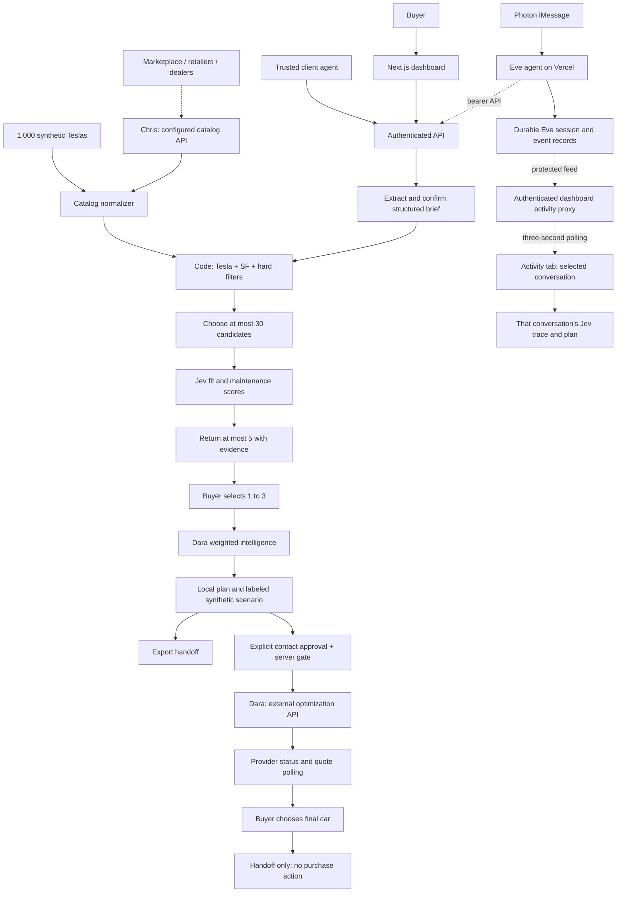
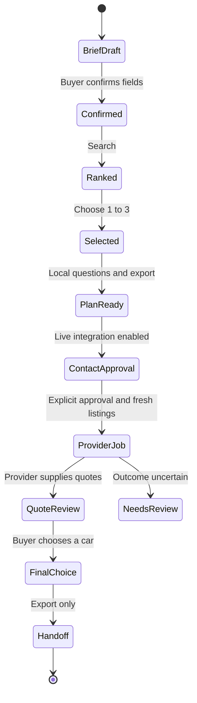

# JEVgotiator build specification

September 26, 2026. Source code and runtime schemas are authoritative. Vercel, Railway, and Eve revision `82ee96a` are verified with live Activity. The user confirmed a real Photon iMessage reply, and its Activity record showed seven messages and five search results. The public landing page, `/dashboard`, browser reset, and Dara intelligence with synthetic negotiation scenarios are deployed. The user confirmed `/reset` and a fresh reply; a new Eve plan returned the Dara scores and labeled scenario.

## 1. The 72-minute scope

Build one working web dashboard and API around a bounded Tesla search in San Francisco. The buyer confirms a brief, sees hard-filter counts and Jev ranking, selects one to three cars, and prepares a negotiation handoff. Chris owns inventory consolidation and the Photon/Eve agent on Vercel; Dara owns optimization and seller workflows; Ben owns the Railway dashboard and API integration. WhatsApp is team coordination, not the buyer channel.

Implemented locally:

- Next.js 16 App Router dashboard: search, shortlist, deal room, and connection status.
- Guided clarification with optional model extraction and an editable confirmation form.
- A deterministic 1,000-record synthetic Tesla catalog and Chris-compatible export adapter.
- Hard eligibility filters, a 30-candidate scoring boundary, Jev evidence scoring, and up to five results.
- Session-bound result tokens, one-to-three selection, local optimization plans, export, and a gated Dara adapter.
- An Eve agent in `eve-agent/` with Photon credentials, three API tools, and private per-conversation shortlist state.
- A visible Jev execution trace: exact bounded input and questions, returned typed scores, code weights, and score composition. It exposes no hidden reasoning or provider credentials.
- An implemented Activity tab and protected feed that read durable Eve conversation records, refresh every three seconds, and expose each conversation's tools, search trace, and selected-car plan without private result tokens.
- Dara’s selected-car intelligence port from `dara-sample` commit `163fa478`, plus separately labeled synthetic-only negotiation scenarios.
- Tests for filter boundaries, privacy projection, provenance, provider failures, Jev response handling, and optimization behavior.

Pending integrations: Chris's real inventory endpoint and Dara's live seller endpoint with durable execution guarantees. Photon send-and-reply and live Activity are verified for the tested sender. The landing/reset/intelligence update still needs deployment and a fresh plan check. There is no purchase execution, payment, application database, scheduled follow-up, or internal durable seller-job worker.

## 2. Architecture and hosting

One Node.js process serves the dashboard and short API requests. A separate always-on agent server is not required for the local planning flow. Dara's service must own any long-running seller job, persistence, and reconciliation after HTTP submission. This repository does not implement a durable workflow engine.

The canonical public site is [jevgotiator.vercel.app](https://jevgotiator.vercel.app). `/` is the public landing page and `/dashboard?view=activity` opens the demo access flow. Vercel and [jevgotiator-production.up.railway.app](https://jevgotiator-production.up.railway.app) each host the complete dashboard and API at verified revision `82ee96a`. Both passed an authenticated clarify → search → plan smoke test with `live_model`, `live_jev`, and `planning` outcomes: 1,000 synthetic records → 82 eligible → 30 scored → five shown → two plans. Vercel root and health requests returned HTTP 200; team login and origin validation passed. Seller contact is disabled, and Railway's synthetic-contact guard also rejected dispatch. These counts describe the tested request, not a general quality benchmark. The long Vercel team alias requires SSO; share the canonical short domain.

Railway config-as-code is not active for this service. `railway.toml` is reference only; remote service settings specify `npm run build`, `npm start`, and `/api/v1/health`. The verified Railway deployment used `serviceInstanceDeploy` with an explicit `commitSha` after a branch connector issue. Railway branch-based auto-deploy is unverified. Vercel is a standalone deployment of the same dashboard/API, not a proxy to Railway.

Production requires `APP_SECRET` and `DEMO_ACCESS_CODE`; set `APP_ORIGIN` to the exact public dashboard origin and inject provider credentials server-side. The separately packaged Eve agent targets Vercel with Node.js 24. Its current channel uses portable Photon project credentials and `IMESSAGE_WEBHOOK_SECRET`; Vercel Connect is an alternative, not the selected provisioning path.

## 3. Actual brief and listing contracts

[lib/contracts.ts](lib/contracts.ts) owns `briefSchema`, `Car`, `Catalog`, `RankedCar`, `SearchResult`, and `Optimization`. The older files in `examples/` document the original richer design; they are not the current route payloads.

The accepted `Brief` has:

| Field | Current meaning |
| --- | --- |
| `query` | Original request, 5 to 2,000 characters; soft preferences are evaluated from this text |
| `budget` | Integer maximum USD amount |
| `budget_basis` | `advertised_price` or `out_the_door` |
| `city`, `make` | Fixed to `San Francisco` and `Tesla` |
| `model` | Optional exact model: `Model 3`, `Model Y`, `Model S`, `Model X`, `Cybertruck`, or `Roadster`; empty means any Tesla model |
| `min_year`, `max_mileage` | Nullable year and mileage-in-miles constraints |
| `body_type`, `fuel_type`, `color` | Exact normalized required values; empty means unconstrained |
| `clean_title`, `no_reported_accidents` | Required reported-history conditions when true |
| `needed_by` | Nullable YYYY-MM-DD availability deadline |
| `priority` | `best_fit`, `lowest_price`, or `low_mileage` |

Clarification uses local extraction by default. With `AI_GATEWAY_API_KEY`, it requests structured extraction from `CLARIFY_MODEL` (default `openai/gpt-4.1-mini`) through Vercel AI Gateway with a ten-second timeout. Failure returns guided mode. A buyer can edit every structured constraint before confirming. The Eve package adds a conversation layer around these API calls; the API itself has no autonomous conversation loop or persisted brief-version history.

`Car` stores price in USD and mileage in miles, not cents. It includes stable ID, make/model/year/trim, color/body/fuel, city, photos, description, accident/maintenance/title history, public seller metadata, source, listing URL, observation timestamp, active/sold/unknown status, availability date, and live/synthetic/replay mode. Private contact values and arbitrary source objects are omitted; contact-like phone/email text is redacted.

The synthetic dataset has 250 each Model 3/Y/S/X, model-appropriate years 2015–2026, six colors, varied condition/history, 950 active records, 30 sold, and 20 unknown. All are in SF and clearly synthetic, with no seller contacts, listing URLs, or real photos. The UI uses illustrative car artwork. `npm run seed:catalog` reproduces stable IDs for a later database import; it does not perform an import.

## 4. Chris's inventory boundary

Set `CATALOG_API_URL` and optional bearer `CATALOG_API_KEY`. Accept an array or `items`, `listings`, or `cars` array. The adapter supports both Chris's initial Pydantic USD/miles records and the original nested cents fixture. Missing status remains unknown, which fails active-only filtering.

The adapter loads the complete supplied catalog before filtering. It follows explicit same-origin `next_url` or URL-valued `next` pagination, up to 20 pages, 5,000 total records, and 8 MB per response. Requests time out after eight seconds per page. Oversized exports fail rather than truncate silently. Missing supported pagination or a larger advertised total creates an incomplete-coverage warning. Configured API failures never substitute demo inventory.

Named provider data from the configured API can be labeled live; this identifies its source, not independent verification of a seller's claims. Explicit synthetic mode always remains synthetic. Unknown provenance is replay. Unknown availability and missing timestamps remain visible in catalog warnings and totals.

Full contract and import instructions: [docs/catalog-integration.md](docs/catalog-integration.md). Browserbase/Stagehand ingestion and history-report retrieval are Chris's upstream work, not implemented by this app.

## 5. Hard filters and bounded Jev ranking

1. Code requires Tesla, San Francisco city, active status, and known asking price at or below budget. It applies specified model, year, mileage, color, make, body, fuel, title, and accident constraints. Model is an exact normalized hard filter, so a Model Y request cannot return a Model 3. Missing required values fail. No-match results preserve all constraints.
2. Out-the-door requests are provisional because `Car` has no verified total quote. Asking price is only a necessary condition; warnings identify taxes, fees, and quote verification. Known availability after the deadline is excluded; unknown dates remain with a verification warning.
3. The route sorts eligible cars by mileage for `low_mileage`; otherwise by asking price. It passes only the first 30 to Jev. This is a candidate cap, not a limit on catalog loading. All eligible, candidate, scored, and shown counts are returned. Above 30, a warning says coverage is limited. This shortlist can miss a better semantic match outside the first 30.
4. Jev receives one bounded batch request using pinned `jev-1.13.0`. Every candidate has a Noul buyer-fit question, plus a maintenance question when maintenance text exists. Each question explicitly identifies its listing index. Descriptions and history are input data, not executable instructions. Private seller contacts are not sent.
5. For `best_fit`, fit carries weight 0.85 and supplied maintenance evidence 0.15. For price/mileage priorities, fit is 0.5, supplied maintenance 0.1, and a code-computed relative numeric factor 0.4. Missing maintenance omits that factor and renormalizes remaining weights. There is no confidence multiplier.
6. Return at most five, with per-factor evidence snippets, unknowns, model, token usage, estimated cost, latency, and mode. Optional `ranking.trace` records all scored candidates, exact questions and bounded model state, accepted or discarded numeric answers, and deterministic score composition. Price and mileage are code-only inputs. The trace distinguishes model scoring from hard filtering and fallback; it is not hidden model reasoning. Every result currently has `verification_required: true`; none is certified purchase-ready.

The Jev request has a 14-second deadline, response/model/answer validation, and no automatic retry. Missing credentials, timeout, incomplete answers, or errors produce `unscored_fallback`: deterministic results with null scores, an explicit warning, and no invented AI judgment. No partial scores are silently mixed into a completed ranking. Estimated cost uses returned input tokens at the configured code rate; it is not an account billing receipt. There is no ranking cache or completed evaluation benchmark yet.

## 6. HTTP routes

All routes below are implemented. Health is public; other business routes require the session cookie or `Authorization: Bearer <INTEGRATION_API_KEY>`. The `/v1/*` paths rewrite to `/api/v1/*`.

| Route | Request / result |
| --- | --- |
| `GET /api/session` | Authentication state |
| `POST /api/session` | `{code}`; establishes an HTTP-only team session cookie |
| `GET /api/v1/health` | Configuration status, not provider connectivity proof |
| `POST /api/v1/clarify` | `{text}` → draft fields, questions, mode, scope, warning |
| `GET /api/v1/listings` | Normalized Tesla catalog with provenance and warnings |
| `POST /api/v1/search` | `{brief}` → ranked results, counts, catalog metadata, encrypted `result_token` |
| `POST /api/v1/optimize` | `{result_token, listing_ids, action: "plan" \| "contact", contact_approved}` |
| `GET /api/v1/optimize?token=...` | Poll Dara using a session-bound job token |
| `GET /api/v1/activity?conversation_id=...` | Authenticated proxy to the protected Eve activity feed; no result tokens or server credentials returned |

`SearchResult` contains `session_id`, `result_token`, `brief`, `results`, `counts`, `ranking`, `catalog`, and `created_at`. Count fields are `total`, `eligible`, `candidates`, `scored`, and `shown`.

Search tokens are encrypted/authenticated with AES-GCM, bound to the current request owner, and expire after one hour. Browser cookies create separate session owners, while the shared integration key maps to `integration-client`. Eve must isolate tokens and result order per conversation; backend per-iMessage-buyer identity is not implemented. The dashboard caches its latest search in browser session storage for one hour. Session cookies and job tokens last one day. This is not a database or durable event log. Selected IDs, current plan, and final choice are UI state; exporting the handoff preserves a JSON snapshot.

## 7. Dara's optimization boundary

`action: "plan"` generates deterministic seller questions and a draft opening message without contacting anyone. It includes battery/drive-unit warranty, battery condition, history, itemized fees, financing conditions, inspection, and timing questions. Actual `target_price` remains null, provider quotes remain empty, and no provider job exists. The plan can be exported.

Dara's `mapListing` and `scoreListing` are ported from commit `163fa478`: value 26%, evidence 23%, road trip 18%, model fit 8%, and mileage/year/battery 25%. They re-rank only the selected cars and preserve Jev's shortlist. Unknown battery uses an explicitly disclosed neutral 50 baseline; photo coverage is not visual inspection. See [docs/dara-integration.md](docs/dara-integration.md).

A separate `synthetic_scenario` is produced only when every selection is synthetic and priced. Its demo rules assume opening at 92%, counter at 98%, and settlement at 95% of asking. The timeline and savings are simulations we added, not Dara's valuation, seller responses, or a prediction. Taxes and fees are excluded. Live, replay, mixed, or unpriced selections never receive simulated seller outcomes. The next deployment must be verified with a new plan; old conversations are not rewritten.

Live dispatch requires all of the following: a valid result token, one to three distinct IDs from that result, explicit `contact_approved: true`, `OUTBOUND_CONTACT_ENABLED=true`, a configured Dara endpoint, and active live listings. The route reloads inventory and blocks dispatch if selected availability, price, seller ID, or live provenance changed.

The adapter POSTs to `DARA_API_URL` with a stable request ID, `Idempotency-Key`, buyer brief, sanitized listings, and authorization scoped to availability checks and nonbinding negotiation. `purchase` is always false. It polls `DARA_API_URL/{job_id}` for provider status. Requests have a 12-second timeout; redirects are refused.

Dara must implement durable acceptance and idempotency. This app's request key prevents accidental duplicate identity within one search but is not a persistent cross-search authorization ledger. A timeout or invalid accepted response can mean seller contact started; reconcile with Dara instead of blindly resubmitting. Provider quotes and events are labeled provider-reported, and missing evidence remains a warning.

Full payload and response shape: [docs/optimization-integration.md](docs/optimization-integration.md).

## 8. Decisions and action boundaries

Selecting cars authorizes interest only. Contact approval covers availability questions and nonbinding negotiation. It never authorizes a deposit, binding offer, payment, financing, signature, or purchase. Final choice is a UI selection, not a durable approval or transaction receipt.

A later purchase adapter would require a persisted approval tied to exact VIN, seller, quote version, currency, total, terms, action, expiry, and one-use identity. Durable intent/receipt storage, transactional deduplication, and uncertain-outcome reconciliation must exist before adding consequential actions. Those are future requirements, not current capabilities.

## 9. Photon and integration handoff

The Eve implementation is in [eve-agent/](eve-agent/README.md), packaged separately for Vercel. The demo is buyer iMessage to the recipient line assigned to that registered Photon sender → Photon → Eve clarification and buyer confirmation → the verified Railway search API. Shared recipient assignments can differ between users. The sender uses their registered personal device; personal sender numbers are not stored in repo documentation. The channel receives requests at `/eve/v1/photon` using portable `IMESSAGE_PROJECT_ID`, `IMESSAGE_PROJECT_SECRET`, and `IMESSAGE_WEBHOOK_SECRET`. The webhook is created and the signing secret stored. The user confirmed a real sent message and received reply. Activity showed the matching conversation with seven messages and five search results.

The [Eve handoff](docs/eve-integration.md) describes the three implemented tools: clarify, confirmed search, and plan selected cars. The agent stores the latest result token and numbered-list mapping privately in durable Eve session state and omits the token from tool output. A reply such as “1 and 3” resolves against that session's result. The bearer API still shares one integration owner, so backend per-buyer authentication remains unimplemented. No contact or purchase tool is exposed. Provider acceptance and actual message delivery need separate evidence.

The live Activity tab polls the authenticated dashboard endpoint every three seconds. Its server proxy uses `EVE_AGENT_URL` and server-held `EVE_API_KEY` to read Eve's protected `/jevgotiator/activity` route. That route reads existing durable workflow/session events through the pinned `@workflow/world-vercel` runtime, without a new database. The view links messages, tool calls, shortlist, Jev trace, and plan to one selected conversation. It labels Photon versus HTTP operator sessions, keeps private tokens out of the browser, and reports unavailable data rather than substituting a conversation. A stored assistant reply proves generation; only its appearance on the sender's phone proves message delivery.

Sending `/reset` in iMessage preserves the old conversation history and starts a new conversation on the next text. The dashboard’s **New web search** button separately clears local web state and its session-storage result, then returns to Search. Eve includes the actual draft message and dashboard link in its plan reply; it does not offer unsupported sending. Out-the-door amounts remain provisional until taxes and fees are verified.

Chris should provide the export URL, authentication convention, one sanitized response, and pagination behavior. Dara should provide the POST/status endpoints, response example, idempotency behavior, and approved test contact. Team acceptance and live integration tests are still required.

## 10. Validation and demo handoff

Run `npm test`, `npm run typecheck`, and `npm run build`. Exercise the dashboard with a normal request, no matches, missing history, an out-the-door budget, a deadline, and one-to-three selection. Verify that synthetic records cannot enter contact dispatch. A configured service is only proven by its successful request and user-visible result.

Vercel, Railway, and Eve revision `82ee96a` are verified, including Activity. Earlier HTTP smoke tests passed model clarification, live Jev search, two selected plans, and the synthetic contact guard. Eve separately passed clarify → five results → plan through the HTTP operator route. The user then confirmed an actual Photon reply on the phone; durable Activity records showed seven messages and five results for that conversation. This proves the tested transport and search path, not real inventory or seller execution.

The landing page and browser reset were verified in the live UI. The user confirmed the iMessage reset acknowledgment and fresh reply. A new three-turn Eve run returned live Jev results, Dara intelligence, and explicitly labeled synthetic offers for two selected cars. Historical conversations retain their original output. The social profile in Dara’s branch is fictional; live social-account analysis remains unimplemented.

Use the [two-minute demo walkthrough](docs/demo-walkthrough.md). Keep synthetic inventory, live inference, deterministic intelligence, simulated negotiation, and provider-reported outcomes visibly distinct. If transport fails, use the dashboard and label the fallback accurately.

Remaining production work includes real inventory, durable seller approvals, authenticated multi-user identities, rate limiting, provider observability, ranking evaluation, and verified seller integrations. No market-coverage, negotiation-success, or purchase-completion claim is established by this demo.

Historical source context: [team sketch](docs/team-sketch.md) and [provider research](docs/integration-research.md). Earlier StayMatch exploration belongs to the event archive, not this product.
