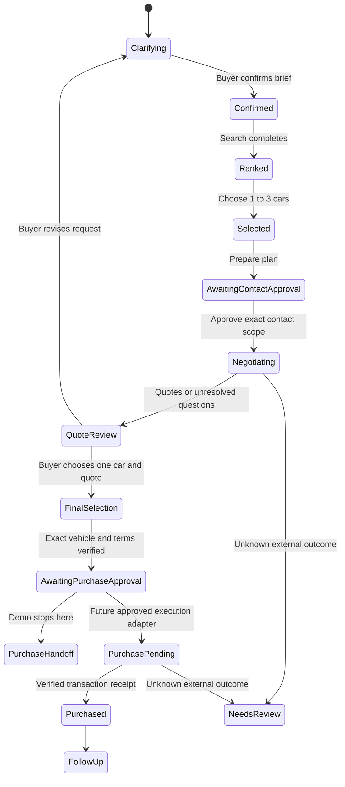

# JEVcar initial build specification

Date: September 26, 2026. Status: proposed integration contract for team review. Product selected by Ben: car search and buying assistance in San Francisco. No production execution is authorized by this document.

## 1. Scope and product boundary

The buyer describes the car they need through a client agent, web client, or Photon iMessage. JEVcar turns that request into a typed brief, filters a catalog, uses Jev to rank suitable cars, and hands one to three selected listings to Dara's negotiation workflow. Quotes return to the buyer for a second decision: choose the final car. The user sees the evidence behind recommendations and the current state of every external action. The [team sketch interpretation](docs/team-sketch.md) records the source notes and uncertain handwriting.

First demo: brief, filter, rank, selection, contact approval, one negotiation result, and a purchase handoff. Support a controlled test seller for the call. If a provider is unavailable, show a labeled replay or pending state. Never show a simulated call or purchase as completed live.

Future purchase execution follows the same state model but requires a separate adapter and acceptance tests. Financing applications, transfers, deposits, signatures, and title changes are not part of the first implementation.

Defaults proposed for the demo: San Francisco city only, USD, up to 30 eligible candidates scored, up to five displayed, and one to three selected. Expanding to the Bay Area requires a changed buyer brief. Catalog size is whatever Chris can reliably supply; prioritize provenance and useful variety over a large count.

## 2. API, agent, and hosting

Use one public Node.js API on Vercel. A durable workflow behind it runs the buying agent. A shared database holds listings, buyer briefs, result snapshots, jobs, approvals, and provider events. Reuse Chris's database if it supports those records; otherwise Ben must choose a small persistent store before implementation. Do not add a vector database for the first slice.

The API validates requests and permissions, runs bounded search, persists state, and reports progress. The agent executes a sequence of tools, waits for callbacks or buyer answers, and resumes from saved state. It must not rely on an open HTTP request or a process-local chat history.

Preferred job host: Vercel Workflows if Dara has no existing durable runtime. Alternative: Dara's worker behind the same HTTP/event contract, especially if her voice provider needs a persistent socket. Do not build both. Vercel account access alone does not establish that either deployment is configured.

Proposed internal boundaries:

| Component | Input | Output | Owner |
| --- | --- | --- | --- |
| Conversation | Message and current brief | Clarifying question or validated brief revision | Ben |
| Catalog | Hard filters, snapshot time, limit | Listings, total eligible count, freshness and coverage | Chris |
| Ranker | Brief revision and eligible listing snapshots | Scored result set with evidence | Ben |
| Buying agent | Negotiation job and contact approval | Availability, quote, call and follow-up events | Dara |
| Channel adapter | Authenticated Photon event | One persisted user message and reply receipt | Ben |

## 3. Clarification produces a contract

The “ideal prompt package” is a versioned `SearchBrief`, not an opaque rewritten prompt. Preserve the original request, explicit answers, and confirmed assumptions. A conversational LLM can extract proposed values and phrase questions; runtime validation and the buyer's confirmation determine the accepted brief. Jev is the decision scorer, not a free-form conversation generator.

Ask for material missing information: maximum budget and whether it means advertised price or out-the-door total; city-only versus a radius; purchase deadline; hard exclusions. Ask at most three focused questions per round. Optional preferences can remain unspecified. Never infer a budget ceiling or permission to contact sellers.

After clarification, show a short confirmation of requirements. Persist an immutable brief revision when searching. Later changes create a new revision and invalidate incompatible selections or approvals.

`SearchBrief` v1 contains:

| Field | Contract |
| --- | --- |
| `schema_version`, `search_id`, `brief_version` | Versioned identity; monotonically increasing brief revision |
| `original_request` | Buyer text, kept private |
| `location` | City, region, country, scope; radius and center only if selected |
| `budget` | `currency`, integer `max_amount_cents`, `basis: advertised_price | out_the_door` |
| `required` | Nullable year bounds, max mileage in miles, make/model allowlists, exterior colors, body/fuel types, title and history requirements; explicit accepted evidence kinds per required history field |
| `preferences` | Buyer-readable criterion, stable ID, nonnegative weight; active weights sum to one |
| `needed_by` | ISO date in `America/Los_Angeles`, or null; deadline to take possession, not listing age or merely signing |
| `unknown_required_policy` | `exclude` for the first demo |
| `assumptions`, `confirmed_at` | Assumptions shown to the buyer and confirmation timestamp |

See [the synthetic brief](examples/search-brief.json). An empty allowlist means unconstrained. `null` means unknown or unspecified, never zero or false.

The sketch's “black car” example maps to `required.exterior_colors: ["black"]` when confirmed as mandatory, or to a weighted preference when optional. Nearby unlabeled numbers are not automatically interpreted as mileage, price or year.

## 4. Chris's car listing contract

Use stable listing IDs with source identity and revision. One vehicle can have multiple listings. Group duplicates by verified VIN when available; otherwise mark suspected duplicates and retain sources rather than merging uncertain vehicles. Preserve conflicting facts.

| Field | Contract |
| --- | --- |
| Identity | `schema_version`, `listing_id`, `listing_version`, nullable `vehicle_id` and `vin` |
| Vehicle | Nullable `make`, `model`, `year`, `trim`, `exterior_color`, `body_type`, `fuel_type`, `mileage_miles` |
| Photos | Array of source URLs and captions; empty when absent; no inferred condition from photos in v1 |
| Price | Currency, nullable advertised price in cents, nullable confirmed out-the-door price, quote evidence, and any disclosed financing condition |
| Location | City, region, country, nullable coordinates, location evidence |
| Seller | `seller_id`, dealer/private/unknown type, public display name, nullable dealer name, private `contact_ref` |
| History | Separate accident status, maintenance status, title status, and history reports |
| Source | Provider, source listing ID and URL, raw text, first/last observation, nullable source publication date |
| Availability | `active | sold | removed | unknown`, seller availability date if known, last confirmation timestamp |
| Evidence | Stable evidence ID, supported field, exact excerpt or document reference, source URL, observation time and evidence kind |
| Mode | `live | synthetic | replay` |

Every nullable or descriptive fact needs its provenance where available. `seller_claim`, `listing_text`, `history_report`, and `independent_verification` are different evidence kinds, not a universal confidence hierarchy. A seller claiming no accidents does not establish an independently verified clean history. `required.history_evidence_requirements` maps each constrained history field to an explicit list of accepted evidence kinds.

The handwritten history label appears to read CARFAX, clarifying the earlier verbal “CarMax history” reference. Represent report provenance explicitly with `history_reports[].provider`, such as `carfax`, rather than treating a retailer listing as a history report. Never manufacture a report from listing text. An absent report stays absent; access to a report provider is not yet verified.

Validate ranges and units during ingestion. Do not map an unavailable price or mileage to zero. Keep private seller contact details in a restricted record referenced by `contact_ref`, outside public search responses and Jev prompts. Retain source URLs and timestamps for later rechecks.

See [the synthetic listing](examples/car-listing.json). The example uses reserved example domains and invented data.

## 5. Filter first, then score

1. Filter 1 applies city or approved radius, active status, advertised-price ceiling, mileage, year, required exterior color, and all other explicit required filters in code. Unknown required facts fail eligibility in v1. Historical evidence must meet the brief's evidence requirement.
2. For an out-the-door budget, an asking price below the cap is only a necessary condition. The total must come from an unexpired quote applicable to this buyer's registration/tax assumptions and financing choice. A listing-level total alone cannot prove eligibility. Unknown or inapplicable totals go in a separate `needs_verification` group with reason `price`; an applicable total above the cap is excluded. Known availability after `needed_by` also fails; unknown possession timing is provisional with reason `timing`. The buyer can inspect or select explicitly labeled provisional candidates for inquiries, but these never count as verified matches or purchase-ready cars. Other unknown hard requirements follow the brief's exclude policy.
3. If more than 30 cars qualify, shortlist by deterministic textual match and explicit numeric preferences, with listing ID as the final stable tie-breaker. Return eligible count and candidate count. Measure candidate recall; Jev cannot recover excluded candidates.
4. Filter 2 uses Jev to score each candidate against a small set of atomic soft criteria. Examples: evidence of suitability for short city trips, support for cargo needs, and documented maintenance matching the buyer's stated preference. Do not infer mechanical safety, accident absence, or future reliability from make/model alone.
5. Code combines normalized criterion scores using confirmed weights. With an ordinal rubric, normalize using its returned scale rather than assuming a 1-to-5 range. Confidence is diagnostic information, not a multiplier. Missing evidence is an explicit `unknown`; it contributes zero in v1, alongside a visible evidence-coverage count.
6. Return up to five strict matches, fewer if fewer qualify, and a separate provisional group of at most five if requested. Include public listing snapshots, factor scores, evidence IDs, unknowns, rank, and warnings. Public and Jev input projections omit `contact_ref`, private contacts, buyer identifiers and unredacted source text. Sanitize excerpts before either projection; full ingestion records stay internal. Use fixed explanation templates and exact permitted evidence excerpts; do not ask Jev to invent a rationale.

Jev request: pinned model initially `jev-1.13.0`, one listing's relevant facts and evidence as state, typed questions with the criterion stated explicitly. Question-map keys are identifiers, not model instructions. Store served model, prompt version, usage, and elapsed time. Scraped text is untrusted data and cannot grant permissions or alter tool policy.

Proposed search budget: 30 candidates, five concurrent scoring requests, eight seconds elapsed for ranking, and at most one retry for transient read-only failures within that deadline. Treat these as tuning targets. On failure, return deterministic eligible order labeled `unscored_fallback`; do not mix incomplete scores into a supposedly complete ranking. Confirm rate limits and measured latency before increasing concurrency.

The intermediate count written in the sketch is unclear. The 30-candidate cap above is an engineering proposal, not a transcription or a user-approved scale requirement. Expose both the full Filter 1 count and the actual Jev candidate count, including whether the candidate cap reduced coverage.

Cache criterion scores by model, prompt version, criterion definition, relevant brief fields, and listing snapshot hash. Changing weights alone can reuse scores and recompute in code; changing the criterion, vehicle facts, or model requires new scoring.

## 6. HTTP contract

These are proposed routes, not currently running endpoints. Authenticated web/API sessions and bound Photon identities scope every search and job to its buyer. Internal catalog and agent routes use separate service credentials. No action trusts a client-supplied owner ID.

Client agents use the same versioned JSON API with buyer-scoped credentials. Agent access to search does not automatically include seller contact or purchase authority. Photon is a channel adapter over these same operations, not a separate backend.

| Route | Request or behavior | Response |
| --- | --- | --- |
| `POST /v1/searches` | Original request and channel context | `201` with search ID, draft brief, `clarifying` or `ready_to_confirm`, and questions |
| `PATCH /v1/searches/:id/brief` | Answers plus expected brief version | Updated validated draft, or `409` on stale version |
| `POST /v1/searches/:id/confirm` | Exact draft version | Confirmed immutable brief revision |
| `POST /v1/searches/:id/results` | Confirmed brief version | Result set with `result_set_id`, rank status, listings, counts, evidence, timing and usage |
| `POST /v1/searches/:id/selections` | Result-set ID and one to three distinct listing IDs | Selection snapshot after freshness checks; no contact |
| `POST /v1/negotiations` | Selection ID and proposed contact/offer scope | `201` draft job in `awaiting_contact_approval` |
| `POST /v1/negotiations/:id/approve-contact` | Exact contact-plan bundle versions and buyer-approved limits | `202` with durable job ID and status URL; server creates bounded approval records atomically |
| `POST /v1/negotiations/:id/final-selection` | One listing ID and exact quote ID/version from this negotiation | Recorded final choice and either `needs_verification` or a purchase handoff; no transaction |
| `GET /v1/jobs/:id` | Buyer-scoped job | State, structured results, pending buyer action, event cursor |
| `POST /v1/jobs/:id/cancel` | Expected job version | Cancellation recorded; any already-started action reported separately |
| `POST /v1/webhooks/photon` | Authenticated provider event | ACK after durable intake; deduplication by provider identity |
| `POST /v1/internal/agent-events` | Authenticated event from Dara's adapter | Idempotent event receipt and state update |

Purchase approval is reserved as `POST /v1/deals/:id/approve-purchase` for a later execution slice. It must reject in the demo with `purchase_execution_unavailable`; no successful-looking stub.

Use an `Idempotency-Key` for mutation requests. Scope it by buyer and operation; bind it to a request-body hash. Reusing the key with a different body returns `409`. Validation errors use `422`; unavailable providers use explicit error codes. Empty results are a successful search with a no-match explanation.

## 7. Selection and Dara's negotiation contract

Result sets capture the brief version, listing versions, score version, timestamp, and source mode. Selection IDs must come from the shown result set. Recheck current price and availability before dispatch; proposed freshness target is 15 minutes, not a guarantee. A changed price, sold car, or failed recheck pauses the handoff for review.

`NegotiationJob` v1 contains job/search/selection IDs, brief revision, one to three immutable listing references, buyer deadline, desired questions, `contact_plans[]`, and correlation ID. Group contact plans by seller; each plan identifies covered listing IDs, exact seller and channel, permitted disclosure, attempt limit, expiry, per-plan approval reference, and whether nonbinding offers are allowed. Proposed offer ceilings specify the covered vehicle and price basis. Budget ceilings are private to the agent and are not automatically disclosed to the seller. Missing contact route, expiry or necessary offer limit prevents dispatch; those values may be null only in a draft.

See [the synthetic handoff](examples/negotiation-job.json). Its approval is null and its state forbids dispatch. Authentication and approval records are stored server-side; a payload claiming approval cannot authorize itself.

Dara returns versioned events with `event_id`, `job_id`, `action_id`, monotonic sequence, provider call ID when applicable, event type, occurrence timestamp, and evidence references. Types include `contact_started`, `contact_uncertain`, `seller_unreachable`, `availability_confirmed`, `quote_received`, `needs_buyer_input`, `completed`, and `failed`.

A quote includes vehicle/listing revision, seller, currency, asking/negotiated price, taxes, fees, add-ons, total, unknown components, conditions, expiration, and evidence. Record whether the total is seller-stated, estimated, or written and confirmed. Do not invent market comparables or call a price a bargain without a dated comparable source. Optimize among comparable quotes using the buyer's budget, conditions, timing, and preferences; preserve unresolved inspection and history questions.

Send the quote comparison back through the buyer's channel before final selection. The buyer chooses one exact vehicle and quote, declines all, or revises the brief. Persist `final_selection` with listing version, quote ID/version and buyer identity; reject stale or expired quotes. Choosing a quote does not accept its terms or execute payment. Invalidate any previous final selection if its quote changes. If the buyer declines all, return to search without creating a purchase action.

## 8. Durable state and action boundaries

Selection authorizes interest only. Contact approval may cover availability questions and bounded nonbinding negotiation. It does not authorize a binding offer, deposit, purchase, financing, or signature. Purchase approval must bind the authenticated buyer to exact vehicle/VIN, seller, quote version, total and currency, terms, action, expiry, and a one-use approval ID. Changed terms invalidate it. In demo mode the only available next step is a handoff, with the purchase-execution gap shown explicitly.

Persist an intent before every external side effect and the receipt afterward. Use provider idempotency where available. If an action times out after submission, mark its result uncertain and reconcile using the provider receipt before retrying. Do not blindly replay calls, offers, messages, or payments when a workflow restarts. Cancellation prevents unsent actions and cannot undo actions already accepted externally.

Use a durable pending-job record plus reliable dispatch/reconciliation. A successful API response means the job was persisted, not that a seller was reached. Jobs survive process restart; events are deduplicated and stale events cannot regress state. Enforce a unique server-side action identity `(approval_id, seller_id, channel, attempt_number)` across jobs. Reserve each attempt transactionally before dispatch; uncertain outcomes consume that attempt until reconciled. Reusing an approval through another job or HTTP idempotency key cannot mint another action. Purchase approval is one-use; contact approval can allow only its specified number of attempts.

Follow-up tasks have a next-run time, scope, attempt limit, and stop condition. Completion requires evidence: quote receipt, inspection result, or transaction receipt as appropriate. A language-model assertion cannot mark a car purchased.

## 9. Photon and Browserbase adapters

Photon carries the conversation into the same API and state model. Verify the provider signature on raw request bytes, deduplicate events, persist intake, and enqueue work before acknowledgment. The documented Spectrum convenience webhook handler runs work after the response; validate deployment behavior rather than assuming it durably submits a job. Use the Node runtime for the managed transport.

Bind conversation and sender identity to a buyer session. Preserve the originating line and message ID. A reply such as “1 and 3” resolves only against the latest applicable result set; ambiguous or stale replies need clarification. Seller messages cannot approve buyer actions. Use an authenticated confirmation view for consequential approval, with explicit terms, rather than treating an ambiguous “yes” as purchase authority. Track outbound provider receipts separately from delivery confirmation.

Chris can adapt the reported Browserbase/Stagehand Facebook Marketplace prototype into ingestion. Pin its exact repository and revision, validate normalized output, and record failed or blocked fetches. Access challenges require operator handling, not bypass logic. A failed refresh must not erase the prior record or mark a car sold. Stop at approved listing collection; scraping does not authorize contacting sellers.

The sketch groups retailer listings, Facebook Marketplace and local car dealers into the master database. Each source normalizes into the same `CarListing` contract and retains its own source identity. The handwritten retailer name is not confidently legible and remains unresolved. These are planned sources, not verified connected feeds.

Browserbase's documented Jev action-selection work is a prototype with a linked PR stack. It is separate from JEVcar's listing scorer; the search API does not depend on that browser integration being released. Keep report retrieval, credentialed sessions, and private contacts outside the public listing response.

## 10. Build order and acceptance

| Slice | Owner | Depends on | Done when |
| --- | --- | --- | --- |
| Freeze v1 contracts and five fixtures | Ben, reviewed by Chris and Dara | None | Each owner accepts IDs, units, unknowns and handoff shape |
| Inventory query | Chris | Contracts | Repeat ingestion preserves IDs, records freshness, filters correctly, retains conflicts |
| Search vertical slice | Ben | Fixtures, then inventory query | Request becomes confirmed brief, eligibility filter, live Jev result, traceable shortlist |
| Negotiation adapter | Dara | Contracts and approved test seller | Job yields structured call outcome and quote with evidence |
| Selection and job dispatch | Ben + Dara | Search and negotiation adapter | One approval creates one durable job; stale listing pauses dispatch |
| Photon round trip | Ben | Search and event intake | One incoming message creates one search and an observed reply receipt |
| Demo and failure rehearsal | All | Prior slices | Happy path plus no-match, provider failure, duplicated event and interrupted call |

Required checks: hard-filter violations cannot rank into results; missing accident/history data stays unknown; OTD unknowns are not shown as budget-confirmed; no-match never relaxes filters; changes to weights preserve the eligible set; candidate and displayed counts are honest; fixture modes appear in the UI; selection alone causes no contact; duplicated webhooks and retries cause one authorized action; changed quotes block stale approvals; cross-user IDs are denied; injected listing instructions cannot trigger tools; a worker restart resumes state without repeating a call.

Use a small labeled evaluation set before tuning prompts, reserve a held-out subset, and compare the same brief, listings, filters and candidate pool with and without Jev. Report ranking quality, hard-constraint violations, unknown handling, latency and usage separately. No benchmark claim before this evaluation exists.

Suggested three-minute demo: 0:00 buyer request and clarification; 0:30 filtered inventory and Jev evidence; 1:15 change a preference and select cars; 1:45 approve and show the test-seller negotiation; 2:30 compare the quote and show the purchase handoff. Label any replay. Finish with one no-match or duplicate-event check if time permits. Confirm the organizer's actual presentation duration separately.

## 11. Immediate decisions and handoff

Current team checkpoint, reported by Ben on September 26: WhatsApp group established for coordination; Chris is consolidating the database; Dara is building optimization; Ben owns planning and integration. No team acceptance of the proposed contracts or working integration is claimed yet.

Next concrete handoffs: Chris supplies five normalized listing records and his query interface; Dara supplies the optimization entry point and one sample quote/status result; Ben connects those boundaries through the buyer brief, filtering, Jev ranking and selection flow. Share contract changes through the team group and keep the agreed version in this repository. WhatsApp is team coordination; Photon iMessage is the buyer interface.

Ben: confirm Chris's database/query interface, Dara's call provider and worker requirements, the Photon line, the Browserbase prototype revision, the retailer source name, and actual history-report access. Until then, the adapters and hosting choices above are proposals. Do not install providers or add parallel frameworks just to fill empty folders.

First integration checkpoint: one synthetic brief plus five listing fixtures passes through Chris's query contract and Ben's ranker; Dara accepts one non-dispatchable negotiation job. Next checkpoint: replace each fixture boundary with verified live behavior and preserve the source-mode labels.

The canonical build plan is this file. Prior hospitality/StayMatch exploration in the event workspace is background, not the selected product. See [provider research](docs/integration-research.md) for current documentation and unresolved live access.
