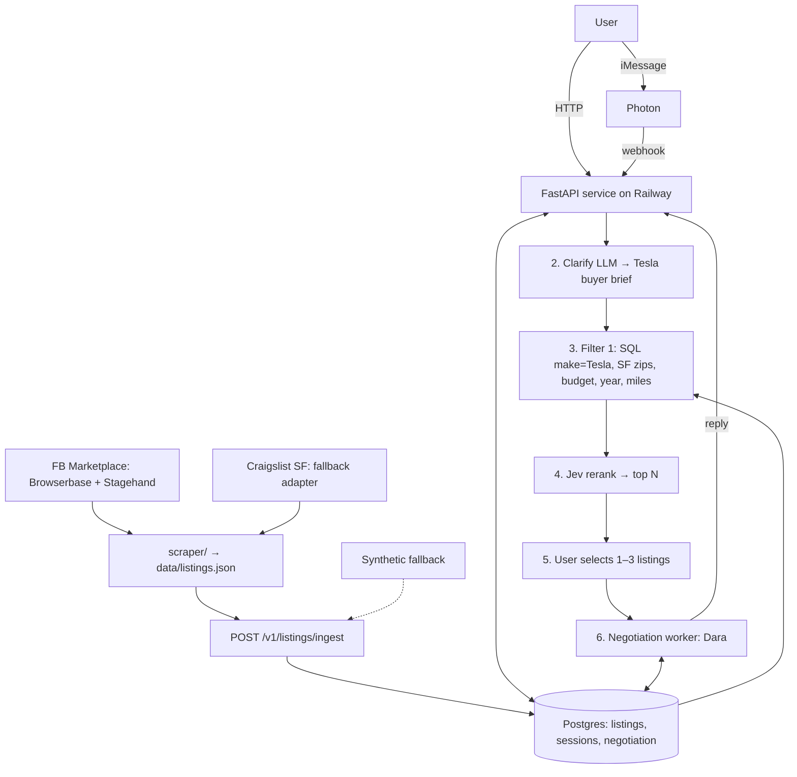
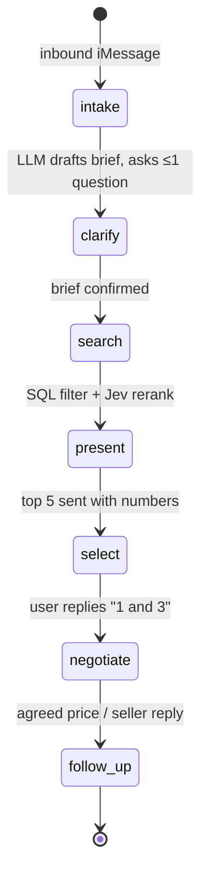

# JEVgotiator

Tell JEVgotiator which used **Tesla** you want in **San Francisco**, by API or iMessage. It turns your request into a structured buyer brief, narrows a master database of **real, scraped listings** (Facebook Marketplace + Craigslist SF, via Browserbase + Stagehand) with SQL, has **Jev (TypeSafe AI)** score and rerank the survivors into a top 5–10, lets you pick 1–3 cars, and hands them to a negotiation agent that drafts outreach and works the price with the seller. Built at the AI Collective JEVathon (repo name `JEVcar` is historical).

Scope for the demo: used Tesla (Model 3 / Y / S / X / Cybertruck), sellers located in San Francisco city proper (zip 941xx — Daly City, Oakland, South SF excluded). Synthetic listings are fallback only and always tagged `source=synthetic`.

## Team and ownership

| Owner | Area | Deliverable |
| --- | --- | --- |
| Ben | Integration, plan, entry points | README/spec, Photon/iMessage conversational agent design, Railway deploy, demo |
| Dara | Intelligence / negotiation layer | `POST /v1/negotiate`, outreach drafting, seller contact, price negotiation, follow-up jobs |
| Chris | Master car database | Postgres schema, `GET /v1/listings`, `POST /v1/listings/ingest`, source normalization |
| Codex | Code | API implementation, clarify + Jev rerank, scraper (`scraper/`), fixtures (`codex/*` branches) |

## Architecture



One FastAPI deploy, one Postgres. The "agent" is a background worker in the same Railway deploy (or a second Railway service on the same database). The scraper is a standalone TypeScript tool run before the demo; no separate agent infrastructure.

## Pipeline stages

| # | Stage | Input → Output | Logged |
| --- | --- | --- | --- |
| 1 | Intake | Raw text via `POST /v1/search` or Photon webhook → `session` row | channel, session_id |
| 2 | Clarify | Raw text → `PromptPackage` (Tesla models, budget, autopilot, range, must-haves, urgency) | fields inferred vs. asked |
| 3 | Filter 1 | `PromptPackage` → SQL over `listings` (`make='Tesla'` default, `zip LIKE '941%'`, price, year, mileage, title) | `candidates_after_sql` |
| 4 | Jev rerank | Candidates → Jev scores → top N (5–10) with reasons | `candidates_scored`, `top_n`, latency, cost |
| 5 | Feedback | User picks 1–3 listing ids → `sessions.selected_listing_ids` | selection |
| 6 | Negotiate | Selections → outreach draft → seller contact → price negotiation → (stretch) purchase + follow-up | job events |
| 7 | Sources | **Scraped** FB Marketplace + Craigslist SF (see [`scraper/`](scraper/README.md)); dealer feeds and synthetic only as fallback; every listing carries `source` | ingest counts per source |

Stage counts (`total → after_sql → scored → top_n`) are returned in every search response so judges can see recall/precision and cost-per-query.

## API spec

Base URL: `https://<railway-app>.up.railway.app`. All bodies are JSON. Stubs return `501` until implemented.

### `GET /health`
```json
{ "status": "ok", "db": "ok", "version": "0.1.0" }
```

### `POST /v1/clarify` — raw text → prompt package
Request:
```json
{ "text": "Model 3 or Y under 30k, want FSD if possible, need it this month" }
```
Response:
```json
{
  "package": {
    "make": "Tesla",
    "models": ["3", "Y"],
    "budget_max_usd": 30000,
    "autopilot_min": null,
    "min_range_mi": null,
    "must_haves": ["clean title"],
    "nice_to_haves": ["FSD"],
    "urgency": "this_month",
    "location": { "city": "San Francisco", "zip": null, "sf_only": true },
    "year_min": 2019,
    "mileage_max": 80000
  },
  "questions": ["Is $30k the sticker price or out-the-door total?"]
}
```

### `POST /v1/search` — raw text → clarified package + ranked top N
Request:
```json
{ "text": "...", "channel": "api", "top_n": 5, "session_id": null }
```
Response:
```json
{
  "session_id": "ses_01J...",
  "package": { "...": "PromptPackage as above" },
  "counts": { "total": 142, "after_sql": 31, "scored": 31, "top_n": 5 },
  "cost": { "jev_calls": 31, "latency_ms": 1830 },
  "results": [
    { "rank": 1, "score": 0.91, "reasons": ["Model 3 LR", "FSD included", "under budget by $2.1k"], "listing": { "...": "CarListing" } }
  ]
}
```

### `POST /v1/sessions/{id}/select` — pick 1–3 listings
```json
{ "listing_ids": ["lst_fb_marketplace_ab12", "lst_craigslist_cd34"] }
```
Response: `{ "session_id": "ses_01J...", "selected": ["..."], "next": "POST /v1/negotiate" }`

### `POST /v1/negotiate` — Dara
Request:
```json
{ "session_id": "ses_01J...", "listing_id": "lst_fb_marketplace_ab12", "target_price_usd": 26500, "walk_away_usd": 28500, "mode": "simulated" }
```
Response:
```json
{
  "job_id": "neg_01J...",
  "status": "drafted",
  "outreach_draft": "Hi, is the 2021 Model 3 Long Range still available? ...",
  "events": [{ "at": "...", "type": "draft_created" }],
  "outcome": null
}
```
`mode: simulated` (demo default) runs against a mocked seller; `live` requires an approval flag.

### `GET /v1/listings` — Chris
Query: `?model=3&price_max=30000&year_min=2019&autopilot=FSD&source=fb_marketplace&limit=50` (always `make=Tesla`, SF zips)
Response: `{ "count": 31, "items": [ CarListing, ... ] }`

### `POST /v1/listings/ingest` — Chris
Request: `{ "source": "fb_marketplace", "items": [ CarListing, ... ] }` (same JSON the scraper writes)
Response: `{ "inserted": 18, "updated": 2, "rejected": [{ "index": 7, "error": "price missing" }] }`

### `POST /webhooks/photon` — iMessage inbound
Photon posts the inbound message; we look up/create the session by sender handle, run search or select depending on state, and reply via Photon's send API.
```json
{ "from": "+14155550123", "text": "model y under 35k", "message_id": "..." }
```
Response: `{ "ok": true, "session_id": "ses_01J...", "action": "search" }`

## Data schema

### `CarListing` (pydantic: `api/models.py`; SQL: `db/schema.sql`)

| Field | Type | Notes |
| --- | --- | --- |
| `id` | string | `lst_<source>_<hash>` |
| `vin` | string \| null | |
| `make` | `"Tesla"` | fixed for this scope |
| `model` | enum | `3 \| Y \| S \| X \| Cybertruck` |
| `year` | int | |
| `trim` | string \| null | Standard Range Plus, Long Range, Performance, Plaid… |
| `mileage` | int | miles |
| `price` | int | USD, advertised |
| `photos` | string[] | URLs |
| `accident_history` | string \| null | e.g. `none_reported`, `minor`, `major` |
| `maintenance_history` | string \| null | |
| `history_report` | object \| null | `{ provider: carmax\|carfax\|autocheck, url, summary }` |
| `location` | object | `{ city, zip, lat, lng }` — zip must be 941xx |
| `seller` | object | `{ type: private\|dealer, name, contact }` — contact never returned publicly |
| `source` | enum | `fb_marketplace \| craigslist \| carmax \| dealer \| synthetic` |
| `listing_url` | string | |
| `listed_at` | datetime | |
| `title_status` | enum | `clean \| salvage \| rebuilt \| lien \| unknown` |
| `how_soon` | string \| null | availability timeline |
| **Tesla-specific (all nullable)** | | |
| `battery_range_mi` | int | stated/EPA range |
| `autopilot_package` | enum | `none \| AP \| EAP \| FSD` |
| `color` | string | exterior |
| `charging_included` | bool | wall connector / mobile charger included |
| `battery_health_pct` | float | if seller states it |

### `PromptPackage` — output of Clarify
`make="Tesla", models[], budget_max_usd, autopilot_min, min_range_mi, must_haves[], nice_to_haves[], urgency (asap|this_week|this_month|flexible), location {city="San Francisco", zip, sf_only=true}, year_min, mileage_max`.

### `sessions`
`id, channel (api|imessage), user_handle, raw_text, package jsonb, counts jsonb, result_ids text[], selected_listing_ids text[], state (new|clarified|ranked|selected|negotiating|done), created_at, updated_at`. Negotiation events go in `negotiation_jobs` / `negotiation_events` keyed by session.

## Data sources: real scraped listings

[`scraper/`](scraper/README.md) (plan; Codex owns implementation) is a standalone TypeScript tool (Browserbase + Stagehand) that searches Facebook Marketplace for Tesla within ~8 mi of SF, visits each listing, extracts the schema above (including Tesla fields), filters to SF-proper zips, and writes `data/listings.json`. A Craigslist SF adapter (`sfbay.craigslist.org/search/sfc/cta?query=tesla`) is the fallback if FB blocks. The JSON is loaded via `POST /v1/listings/ingest`. Runs are capped (~20 listings), read-only, logged-out; see the rate/ethics note in the scraper README.

## Conversational agent (Photon / iMessage)



- **Number**: a Photon-provisioned iMessage number. Photon delivers inbound messages to `POST /webhooks/photon` (`{from, text, message_id}`), verified with `PHOTON_WEBHOOK_SECRET`.
- **Session state machine keyed by phone**: `sessions.user_handle = from`. The webhook loads the open session for that phone (or creates one) and dispatches on `sessions.state`: `new → intake`, `clarified → search`, `ranked → select` (parse "1 and 3" against `result_ids`), `selected → negotiate`, `negotiating → follow_up`. Every step persists state before replying, so a dropped message is safe to retry.
- **Replies**: the API responds `200` immediately and sends the user-facing text via Photon's send API (`PHOTON_API_KEY`). Long steps (search + Jev, negotiation) are enqueued; the worker sends the reply when done, so iMessage never waits on an open HTTP request.
- **Agent runtime**: the same FastAPI deploy. The background worker (`python -m worker`, Procfile `worker`) polls `sessions` / `negotiation_jobs` and runs search, negotiation, and follow-up. No separate agent infrastructure; a second Railway service on the same Postgres is the only scale-out step.
- **Commands**: "start over" resets the session; "stop" ends it.

## Hosting / deploy

- **Railway project**: `web` (FastAPI via uvicorn, exposes `/v1/*`, `/webhooks/photon`, `/health`) and **Postgres** (Railway plugin; pgvector optional, not required for v1).
- **Agent worker**: background loop in the same deploy (`python -m worker`) or a second Railway service using the same `DATABASE_URL`. Polls `negotiation_jobs` and runs Dara's logic.
- Secrets via Railway env vars (see `.env.example`): `DATABASE_URL`, `TYPESAFE_API_KEY`, `OPENAI_API_KEY`, `PHOTON_API_KEY`, `PHOTON_WEBHOOK_SECRET`, `BROWSERBASE_API_KEY`, `BROWSERBASE_PROJECT_ID`, `STAGEHAND_MODEL`.
- Photon webhook URL → `https://<app>/webhooks/photon`.

## Repo layout

```text
api/                 FastAPI app: main.py (routes), models.py (pydantic schemas)
db/schema.sql        listings (with Tesla fields), sessions, negotiation_jobs/events
scraper/             Browserbase + Stagehand scraper plan (Codex): FB Marketplace + Craigslist SF
data/                scraper output (listings.json)
negotiation/         Dara's layer — README stub
worker/              background job loop (stub)
.env.example, requirements.txt, Procfile
```

Codex's contract fixtures and `BUILD-SPEC.md` live on `codex/*` branches and will be merged into `examples/` and `docs/`.

## Demo script (3 min)

1. **0:00** Show `data/listings.json` scraped before the demo: real Tesla listings in SF with `source`, `autopilot_package`, `battery_range_mi`. "Every car you're about to see is live on Marketplace right now."
2. **0:30** Text the Photon number from a phone: "Model 3 or Y under 30k, FSD if possible, need it this month". Reply asks one clarifying question; answer it.
3. **1:00** Terminal log: `total=142 → after_sql=31 → jev_scored=31 → top_n=5`, latency and cost-per-query.
4. **1:30** iMessage shows 5 ranked Teslas with one-line Jev reasons and links. Reply "1 and 3".
5. **2:00** Negotiation agent (simulated seller) drafts outreach, seller replies, agent counters; final agreed price vs. asking.
6. **2:40** Railway dashboard: one service + Postgres. Done.

## What's mocked

- Seller side of negotiation is simulated (`mode: simulated`); no real messages leave the system.
- Purchase, deposit, and follow-up are not implemented (stretch).
- If a live scrape fails during setup, `source=synthetic` fallback rows are loaded and clearly tagged; the demo says so.
- Dealer/CarMax feeds are not wired; `history_report` is null unless a listing links a real report.

## Open questions

- Node.js/Vercel (Codex's draft spec) vs. FastAPI/Railway (this README): this README is the decision; reconcile `BUILD-SPEC.md` when merging.
- FB Marketplace logged-out access from Browserbase: may hit a login wall; Craigslist adapter is the fallback.
- Clarify LLM model and max clarifying rounds (proposal: 1 round for demo).
- Jev call shape: one scoring call per candidate vs. batched; cap candidates at ~50 before rerank?
- Budget semantics: advertised vs. out-the-door.
- Photon: sender identity → session mapping and reply rate limits.
- Whether Dara's worker needs a persistent socket (voice) → second Railway service.
