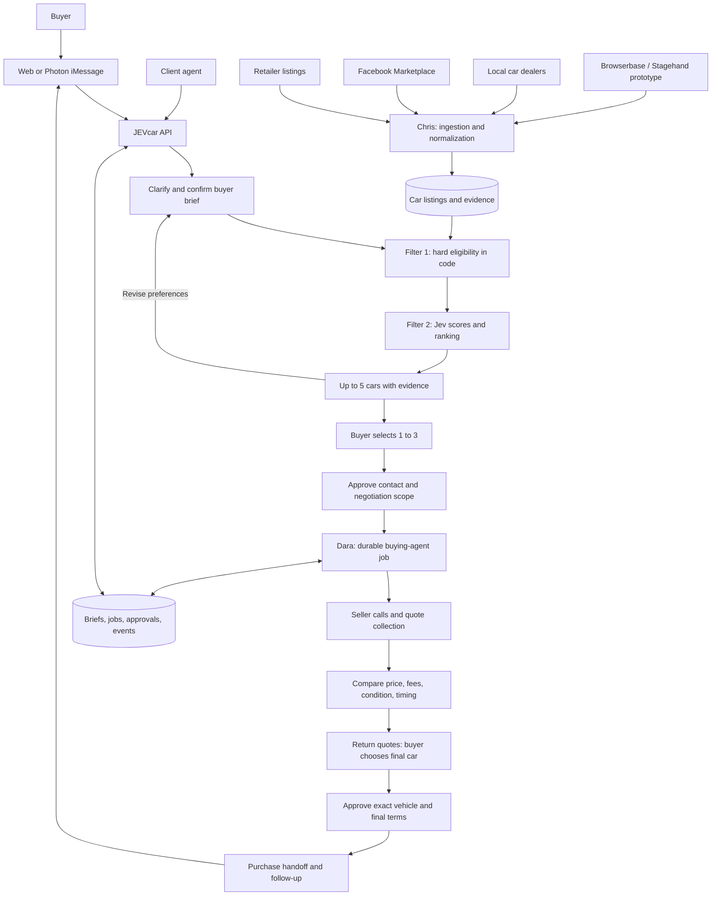

# JEVcar

Tell JEVcar what car you need. It searches listings in San Francisco, ranks the eligible cars with Jev, and helps you negotiate the ones you choose.

**Status:** initial design for a three-person JEVathon team. This repository contains the plan and integration contracts. The application and deployment are not implemented here yet.

## The product

1. Send a request from a client agent through the API, a small web interface, or Photon iMessage.
2. Answer only the questions needed to turn the request into a confirmed, structured buyer brief.
3. Filter the car database by budget, location, mileage, year, and other hard requirements.
4. Let Jev score how well the eligible cars match the buyer's preferences. Return up to five cars with evidence, unknowns, and source links.
5. Pick one to three cars. Review and approve a contact and negotiation plan.
6. The buying agent checks availability, contacts sellers, negotiates within approved limits, and compares quotes.
7. Receive the negotiated quotes and choose the final car. Approve its exact terms before any purchase action. Track inspection, purchase, and follow-up as separate states.

The database is an inventory of observed listings, not a claim to contain every car for sale in San Francisco. Advertised price, confirmed total price, and estimated total price remain distinct.

## Architecture



**Recommended hosting:** a Node.js API on Vercel, shared persistent storage, and durable jobs for the agent. The agent is application logic that can pause and resume; it does not inherently need its own always-on server. Use Vercel Workflows or Dara's existing durable worker. If the chosen voice SDK requires a persistent connection, host that worker separately behind the same job contract.

Search and clarification use short HTTP requests. Scraping, calls, negotiation, and scheduled follow-up run asynchronously. Jev evaluates typed questions; a conversational model handles clarification and language. Code owns filters, price arithmetic, approvals, and state transitions.

## Team ownership

Team coordination is in WhatsApp. Ben's September 26 update: Chris is actively consolidating the database, and Dara is building the optimization layer. This is reported work in progress; their implementations and shared contracts have not yet been integration-tested here. Photon iMessage remains the proposed buyer-facing channel.

| Owner | Deliverable | Integration boundary |
| --- | --- | --- |
| Chris | Database consolidation, listing ingestion, freshness and deduplication | Versioned `CarListing` records and an eligible-listings query |
| Dara | Optimization layer: pricing intelligence, seller calls, negotiation, purchase coordination and follow-up | `NegotiationJob` in; structured events and quotes out |
| Ben | Plan, public API, buyer brief, Jev ranking, Photon adapter and integration | Shared contracts, user journey, deployment and demo |

Ben owns changes to shared contracts after checking them with Chris and Dara. Each person keeps their existing implementation choices where they satisfy the contract.

## Build packet

- [BUILD-SPEC.md](BUILD-SPEC.md): scope, contracts, endpoints, ranking, jobs, approval states, build order and acceptance checks.
- [Integration research](docs/integration-research.md): verified provider capabilities and unresolved integration choices.
- [Team sketch interpretation](docs/team-sketch.md): rough-note flow, field mapping and uncertain handwriting.
- [Car listing example](examples/car-listing.json), [buyer brief example](examples/search-brief.json), and [negotiation handoff example](examples/negotiation-job.json): synthetic fixtures for parallel development.

Proposed implementation layout, to create as code is added:

```text
apps/api/          HTTP routes, Photon adapter, buyer conversation, ranking
apps/agent/        Dara's job adapter and buying workflow
packages/contracts/  Shared runtime schemas and types
packages/catalog/    Chris's listing queries and normalization adapter
examples/         Synthetic contract fixtures
```

There is no application run command yet. No provider credentials belong in this repository; inject them from the vault into the runtime environment.

## First working demo

A buyer asks for a car under a stated budget in San Francisco. JEVcar clarifies the budget basis and timeline, filters real or clearly labeled demo listings, and ranks five candidates. The buyer selects up to three, authorizes a bounded seller contact, and receives a quote comparison. A purchase-ready handoff shows the next approval needed.

Actual payment, financing, deposits, title transfer, and signatures are outside the first demo. The design leaves a specific approval boundary for later execution. Live, synthetic, and replayed steps must be labeled.

## Known gaps

Chris's database technology, Dara's call provider and runtime, and the team's Browserbase prototype revision are not confirmed. Inventory sources in the diagram are planned; the sketch's retailer name needs confirmation. Photon line setup and end-to-end messaging are untested. Earlier session checks verified TypeSafe inference and Vercel account access, but do not establish a deployed JEVcar integration.

## Name shortlist

Keep **JEVcar** as the working name and repository. Five alternatives:

1. **JEVKeys**: from a buying brief to keys in hand. Best fit for the full journey.
2. **JEVDeal**: emphasizes negotiation and getting the right deal.
3. **JEVDrive**: simple, memorable, and broad enough for the product to grow.
4. **JEVMatch**: emphasizes finding a car that fits the buyer.
5. **JEVGarage**: emphasizes the car inventory and comparison experience.
