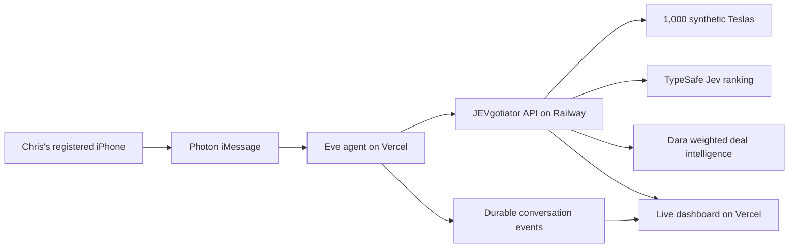
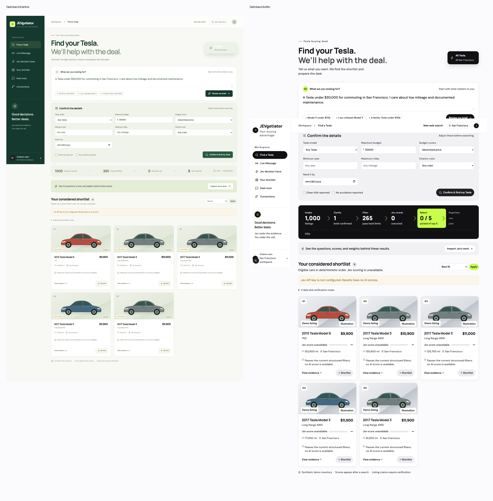
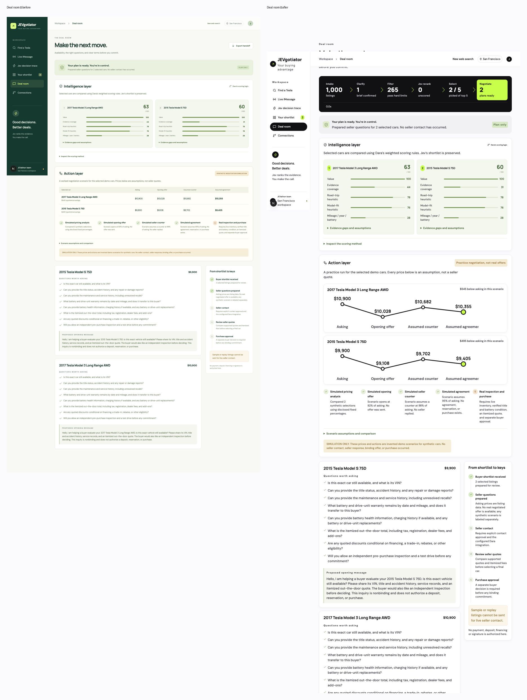

# JEVgotiator

Buyers text Eve about a Tesla in San Francisco. Eve clarifies the request, our API applies hard filters, TypeSafe Jev scores the evidence for up to 30 candidates, and the buyer gets five options. After the buyer picks one to three, Dara's weighted rules prepare a nonbinding deal plan. The web dashboard shows the actual iMessage conversation, observed tool calls, shortlist, and Jev decision trace for that same Eve session.



The Next.js 16 app includes the dashboard and API. It ships with 1,000 clearly labeled synthetic Teslas. Dara's weighted intelligence rules from branch commit `163fa478` are ported for the buyer's selected cars, with a separately labeled synthetic negotiation scenario. Her MarketCheck dealer-inventory adapter now maps live price, mileage, photo, color, and listing URL into the same car contract when a working server-side key is configured. Chris's catalog API takes precedence when configured. Jev runs when its server credential is configured; otherwise results are explicitly unscored. The [Eve agent](eve-agent/README.md) implements the Photon buyer conversation and calls the same API.

The Find a Tesla dashboard includes a clearly synthetic buyer profile and a Tune the match panel based on Dara's sample. Model, price, mileage, and black-exterior controls update hard search filters when **Refresh matches** is pressed. Value, evidence-coverage, road-trip, and profile-fit sliders immediately reorder the five returned cars using Dara's model heuristics, with a fixed 25-point mileage/year/battery baseline. Evidence coverage counts available photos and reported title status, not visually inspected condition. Profile match is labeled separately from Jev's original score and trace; it does not analyze a real person's social data or override hard constraints.

Open [the public site](https://jevgotiator.vercel.app) or [live sessions](https://jevgotiator.vercel.app/dashboard?view=activity). Vercel, Eve, and [Railway](https://jevgotiator-production.up.railway.app) have verified live deployments. The core intelligence flow was checked at `82ee96a`; participant labels and preserved demo links were checked at `2cf8f46`. A fresh Eve run completed clarification, live Jev search, and a two-car plan containing Dara scores and a labeled synthetic negotiation scenario. Seller contact is disabled. Use the short Vercel domain; the long team alias requires SSO.

The user confirmed a real Photon iMessage send-and-reply round trip. The durable Activity feed showed seven messages and five search results for that conversation. Activity polls every three seconds. For the judge demo, the workbench follows only new sessions from Chris's registered phone; earlier team sessions remain saved but are hidden from this view. The conversation and trace show the same short session ID. The workbench shows observed workflow stages, recent messages, shortlist, and Jev trace; full history and detailed plans are expandable. Personal sender numbers and credentials do not belong in this repository.

The landing page shows the architecture and stack. On Chris's phone, text `/reset` to preserve prior iMessage history and start a fresh conversation on the next text; the user confirmed the reset acknowledgment and fresh reply on a registered phone. The dashboard’s **New web search** button separately clears browser search state. Generate a new plan to show Dara intelligence; historical plans are not rewritten. Follow the [two-minute walkthrough](docs/demo-walkthrough.md).

## What the judge can inspect

1. Send a request from Chris's registered phone and see the buyer and Eve messages appear in **Live iMessage**.
2. Confirm Eve's brief. The stage strip changes from Brief to Filters to Jev ranking as those tools actually run.
3. Open **Inspect this conversation's Jev trace**. It shows the buyer request, bounded candidate facts, typed questions, Jev's returned scores, the final weighted arithmetic, model, latency, and estimated cost. The session label ties it to the text exchange.
4. Pick one to three numbered cars. Dara's plan shows value (26%), evidence (23%), road-trip fit (18%), model fit (8%), and mileage/year/battery baseline (25%). Her source prototype includes a synthetic buyer profile for city driving, road trips, cargo, and visual style. Our live flow uses model heuristics, not personal social-media data.

The buyer brief supports model, budget, maximum mileage, and black exterior as hard filters. Every connected live listing is marked **INSPECT** because provider data does not verify its VIN, battery, or physical condition. The MarketCheck adapter fetches at most 50 active used Teslas in San Francisco and caches the response for ten minutes per API process. More inventory may exist outside this bounded page. The credential supplied for this demo returned HTTP 401 in both API-key and OAuth checks, so production continues to use labeled synthetic inventory until a working MarketCheck key is supplied. No invalid credential was deployed.

### Screenshots





These are before/after captures from the dashboard design pass, using synthetic example cars. The [live iMessage workbench](https://jevgotiator.vercel.app/dashboard?view=activity) starts empty for the judge until Chris starts a fresh session.

## Run

Use Node.js 22 or 24.

```sh
npm ci
npm run dev
```

Open http://localhost:3000 for the landing page or http://localhost:3000/dashboard for the demo. Local development works with synthetic inventory, guided brief extraction, unscored search, and negotiation planning without provider credentials. The development launcher supplies a temporary session secret.

Inject secrets through the vault or the host's environment settings. [.env.example](.env.example) lists variable names only.

| Variable | Purpose |
| --- | --- |
| `APP_SECRET`, `DEMO_ACCESS_CODE` | Required for production sessions and team access |
| `APP_ORIGIN` | Exact public dashboard origin, such as `https://your-service.up.railway.app`, for request-origin validation |
| `TYPESAFE_API_KEY` | Live Jev ranking |
| `AI_GATEWAY_API_KEY`, optional `CLARIFY_MODEL` | Model-assisted brief extraction; guided/manual entry remains available |
| `CATALOG_API_URL`, optional `CATALOG_API_KEY` | Chris's inventory export |
| `MARKETCHECK_API_KEY` | Optional MarketCheck active dealer inventory when Chris's export is not configured; server-side only |
| `DARA_API_URL`, optional `DARA_API_KEY` | Dara's job submission and polling |
| `OUTBOUND_CONTACT_ENABLED` | Defaults to false; live contact also requires buyer approval and active live listings |
| `INTEGRATION_API_KEY` | Optional bearer access for trusted integration clients |
| `EVE_AGENT_URL`, `EVE_API_KEY` | Dashboard server access to the protected Eve activity feed; never sent to the browser |

```sh
npm test
npm run typecheck
npm run build
npm start
```

Regenerate the deterministic import dataset with `npm run seed:catalog`. It writes [data/catalog.json](data/catalog.json), not a database. [railway.toml](railway.toml) is a reference: Railway config-as-code is not active for this service. The remote service settings use `npm run build`, `npm start`, and `/api/v1/health`. The verified deployment was requested with an explicit commit SHA through `serviceInstanceDeploy`; branch-based auto-deploy remains unverified.

## Integration map

- **Chris:** catalog consolidation and the Eve/Photon integration. The agent implementation is in [eve-agent/](eve-agent/README.md). [Catalog contract](docs/catalog-integration.md) and [Eve API handoff](docs/eve-integration.md).
- **Dara:** implemented selected-car intelligence rules; seller contact and quote collection remain pending. [Intelligence port and simulation](docs/dara-integration.md), [live optimization contract](docs/optimization-integration.md).
- **Ben:** dashboard, clarification, hard filters, Jev ranking, integration, and deployment.
- **WhatsApp:** team coordination. **Buyer messaging:** Photon → Eve on Vercel → this API on Railway. Portable Photon credentials and the webhook signing secret connect `/eve/v1/photon`. The live dashboard Activity tab reads the selected Eve conversation through a protected server proxy. A real iMessage reply and matching Activity records are verified.

[BUILD-SPEC.md](BUILD-SPEC.md) describes the implemented architecture, routes, contracts, and remaining work. Runtime contracts live in [lib/contracts.ts](lib/contracts.ts). Files under `examples/` preserve the earlier design fixtures and are not the current HTTP request shapes.

## Known gaps

- Inventory is synthetic until Chris's API or a working MarketCheck key is connected. The screenshot credential returned HTTP 401 and was not deployed. The 30-candidate Jev scoring cap is explicit; ranking does not evaluate the entire eligible pool. The MarketCheck adapter reads only the first 50 matching dealer listings and caches for ten minutes per process.
- This API has no application database, durable seller-job queue, scheduled follow-up, or persistent approval ledger. Eve stores conversation state and events in its existing durable workflow runtime; Activity adds no database. The shared bearer credential still does not provide backend per-buyer authentication.
- Dara's live adapter still needs an endpoint with durable job storage and idempotency. Local intelligence makes no network calls. Synthetic-only scenarios assume offers at 92%, counters at 98%, and settlement at 95% of asking; these are demo rules, not real quotes, market valuations, or predicted seller behavior. Actual target prices and provider quotes remain empty.
- Browserbase ingestion, seller contact, and provider quote delivery remain unverified. Photon send-and-reply transport is verified for the tested registered sender.
- Asking price does not prove an out-the-door budget. History, battery condition, availability, fees, and seller claims require verification.
- No purchase, payment, deposit, financing, signature, or title-transfer action exists. Final choice and JSON export are a handoff only.
