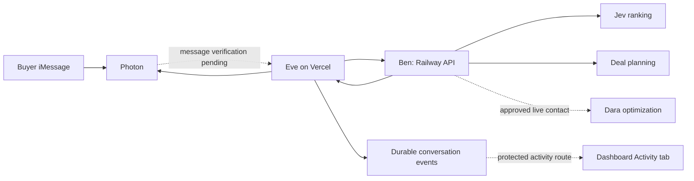

# Eve and Photon integration

The [Eve agent](../eve-agent/README.md) is implemented in this repository as a separate Node.js 24 package. It has a Photon channel and three API tools. Both [Vercel](https://jevgotiator.vercel.app) and Railway revision `ecfd8ca` passed authenticated model-clarification → live-Jev-search → selected-plan smoke tests. Eve production `4211660` passed a three-turn live HTTP operator conversation. The Photon webhook is created and its signing secret stored. The staged Activity feed reads durable Eve records; its deployment, actual inbound iMessage, and observed phone replies remain unverified.



## 1. Deploy the implemented channel

Set the Vercel project's root directory to `eve-agent`. The package has its own lockfile, build, tests, and runtime. From that directory, run `npm ci`, `npm test`, `npm run typecheck`, and `npm run build`. Local development uses `npm run dev`; `npm exec -- eve dev --no-ui` starts the HTTP server without the terminal UI. Do not rerun channel scaffolding to compile or deploy the existing source.

The selected setup uses the existing Photon project's portable credentials and a signed webhook at `/eve/v1/photon`. [agent/channels/photon.ts](../eve-agent/agent/channels/photon.ts) loads them from the environment. The webhook is already registered and its signing secret stored in 1Password; configure the deployed agent's encrypted `IMESSAGE_WEBHOOK_SECRET` from that value. Do not create a duplicate webhook. The demo line is +1 (415) 605-7073. Test from the registered personal sender without adding that sender's number to the repo. Configuration is not proof that Photon delivered a message. [Photon's Eve integration](https://photon.codes/docs/integrations/eve).

Vercel Connect remains an alternative: set `PHOTON_CONNECTOR_ID` to use the existing credential loader. That path defaults to same-project Vercel OIDC verification and does not require a portable webhook secret. The official `eve add channel/photon-imessage` wizard can provision that alternative, but may overwrite existing channel code. It is not part of the current portable setup.

Set these only in the Eve server environment:

| Variable | Value or source |
| --- | --- |
| `JEVGOTIATOR_API_URL` | `https://jevgotiator-production.up.railway.app` |
| `JEVGOTIATOR_API_KEY` | 1Password item **JEVgotiator Demo Runtime**, field **INTEGRATION_API_KEY** |
| `IMESSAGE_PROJECT_ID`, `IMESSAGE_PROJECT_SECRET` | Existing Photon project credentials from 1Password |
| `IMESSAGE_WEBHOOK_SECRET` | Signing secret for the registered direct Photon webhook |
| `AI_GATEWAY_API_KEY` | Needed for local model access; Vercel can use its OIDC credential |
| `EVE_API_KEY` | Separate operator credential for authenticated HTTP session tests |

The API key must match Railway's `INTEGRATION_API_KEY`. Keep it out of messages, tool outputs, client code, and logs. The dashboard access code is not the API credential. Railway is serving the configured Eve API target above. Vercel independently serves the same dashboard/API at [jevgotiator.vercel.app](https://jevgotiator.vercel.app), the canonical public dashboard; its long team alias requires SSO. Both hosts passed `live_model`, `live_jev`, and `planning` smoke tests with 1,000 synthetic records → 82 eligible → 30 scored → five shown → two plans. Vercel also passed root/health HTTP 200, team login, and origin validation; seller contact is disabled. This establishes the dashboard/API deployments, not a successful Eve or iMessage conversation.

Every business request uses `Authorization: Bearer <server-held key>` and `Content-Type: application/json`. Make requests server-to-server, without forwarding the Vercel browser Origin header. No dashboard login cookie is required for bearer access.

## 2. Three implemented tools

The tools are [clarify_car_request](../eve-agent/agent/tools/clarify_car_request.ts), [search_teslas](../eve-agent/agent/tools/search_teslas.ts), and [prepare_deal_plan](../eve-agent/agent/tools/prepare_deal_plan.ts). Search requires `buyer_confirmed: true`; plan selection uses positions from the saved shortlist. The following sections describe their underlying HTTP calls. Shell, filesystem, browser, delegation, seller-contact, and purchase tools are disabled or absent.

### Clarify a buyer request

`POST /api/v1/clarify`

```json
{"text":"Find a Tesla Model Y under $30000 in San Francisco with under 70000 miles."}
```

Response keys: `draft`, `questions`, `mode`, `scope`, and `warning`. The draft is not yet a complete brief. Ask the buyer for missing budget or material constraints, confirm advertised price versus out-the-door total, and show the interpreted requirements before searching. Keep query text and model constraints consistent. Do not turn a monthly payment into a purchase budget.

### Search a confirmed brief

`POST /api/v1/search`

This is a valid current request shape, not a captured result:

```json
{
  "brief": {
    "query": "Find a Tesla Model Y under $30000 in San Francisco with under 70000 miles.",
    "budget": 30000,
    "budget_basis": "advertised_price",
    "city": "San Francisco",
    "make": "Tesla",
    "model": "Model Y",
    "min_year": null,
    "max_mileage": 70000,
    "body_type": "",
    "fuel_type": "",
    "color": "",
    "clean_title": false,
    "no_reported_accidents": false,
    "needed_by": null,
    "priority": "best_fit"
  }
}
```

The response is `SearchResult` in [lib/contracts.ts](../lib/contracts.ts):

- `session_id`, `result_token`, `brief`, and `created_at` identify this search snapshot.
- `results` contains up to five `{listing, score, factors, reasons, unknowns, verification_required}` objects.
- `counts` reports total inventory, eligible records, candidates, scored, and shown. At most 30 eligible candidates are scored; do not describe the result as exhaustive ranking of all inventory.
- `catalog.mode` and warnings distinguish synthetic, live, and mixed provenance. Current bundled inventory is 1,000 synthetic Teslas, with no real sellers.
- `ranking.mode` is `live_jev` or `unscored_fallback`. Include the fallback warning rather than claiming Jev ranked a failed request.
- `ranking.model`, `input_tokens`, `estimated_cost_usd`, `latency_ms`, and `warning` provide diagnostics. Optional `ranking.trace` records request/answer evidence, requested and returned models, candidate state, typed questions, validity/usage flags, and code weight composition. This is an execution trace, not hidden reasoning. Avoid dumping the full trace into iMessage.

Present a compact numbered shortlist with asking price, mileage, year/model, and material unknowns. Keep synthetic inventory visibly labeled even if Jev inference was live.

### Prepare a plan for selected cars

`POST /api/v1/optimize`

```json
{
  "result_token": "<opaque token from this conversation's latest search>",
  "listing_ids": ["<actual listing ID selected from that result>"],
  "action": "plan"
}
```

Resolve “1 and 3” using that conversation's current displayed result order. Pass one to three distinct returned listing IDs, never invented IDs or row numbers. Preserve the result token exactly. The API rejects selections outside its encrypted result snapshot and expired tokens.

The response contains `plans`, `quotes`, `events`, `mode`, `status`, and warnings. A planning response creates seller questions and an opening message; it does not contact a seller or negotiate a price. Explain this in the reply. Dara's live workflow is a separate pending integration. Do not expose a contact-dispatch or purchase tool in this first Eve handoff.

## 3. Conversation isolation and failure behavior

The implemented `searchState` stores `{session_id, result_token, results, brief, created_at}` privately through Eve's durable per-session state. Tool responses omit the opaque result token. A new search clears the prior mapping before making the request, so failure cannot silently reuse an old shortlist. On token expiry, search again and ask the buyer to reconfirm selections.

The current backend assigns all requests using the integration key to the shared owner `integration-client`. It does not cryptographically distinguish individual iMessage buyers. The Eve adapter must enforce conversation isolation, and backend per-buyer authentication remains production work. The API's browser cookie sessions have separate owners; do not transfer browser result tokens into the bearer flow.

Handle non-2xx `{error}` responses explicitly. A health response reports configuration only, not provider connectivity. Use a client timeout that allows the bounded search to finish, and do not silently invent results after an error. The live contact adapter has uncertain-outcome rules and must not be automatically retried. No purchase, deposit, payment, financing, signature, or title action exists.

## 4. What remains to verify

Vercel and Railway dashboard/API acceptance passed on `ecfd8ca`; Railway also rejected synthetic seller contact. Eve production `4211660` passed three real HTTP operator turns using its model and tools: clarify, search returning five results, and prepare a plan for option one. Health and authenticated operator requests returned 200; unauthenticated session creation returned 401, and unsigned Photon requests returned 400 for a missing signature. These are operator tests, not iMessage delivery evidence.

The staged dashboard Activity tab polls `/api/v1/activity` every three seconds. The dashboard server uses `EVE_AGENT_URL` and its server-held `EVE_API_KEY` to read Eve's protected `/jevgotiator/activity` endpoint. The feed reads existing durable session/event records through the pinned `@workflow/world-vercel` runtime; it adds no database. The browser receives a sanitized view of messages, tool activity, the selected conversation's search and Jev trace, and its negotiation plan. Private result tokens and server credentials are excluded. The new implementation passed 44 root tests, TypeScript checking, and the Next.js build; deployed Activity readback is still pending.

Run the [two-minute walkthrough](demo-walkthrough.md) from an actual iMessage and observe the reply. Follow the Photon-labeled conversation in Activity, confirm the brief in iMessage, inspect that conversation's Jev trace, then select one to three cars and watch its plan appear. A recorded assistant message proves generation, not delivery. Test two independent conversations to ensure “1” selects each conversation's own first listing, and verify no seller contact occurs. Record inbound receipt, API outcome, Activity updates, and the reply visible on the phone separately. Chris's real catalog and Dara's execution endpoint remain pending.
