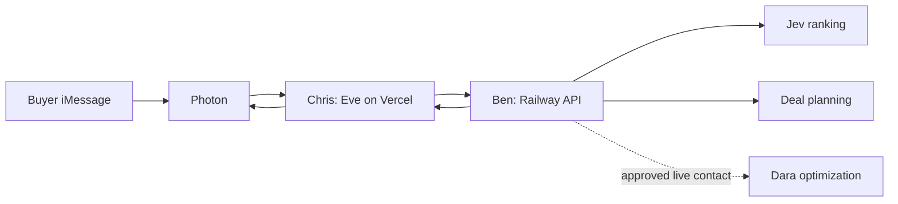

# Chris's Eve and Photon handoff

Chris owns the Eve agent on Vercel and its Photon iMessage channel. Ben owns the dashboard and search API on Railway. Dara owns the separate optimization service. This document specifies the prototype integration; end-to-end live verification is pending.



## 1. Set up the channel and credentials

Inside Chris's Eve project, run `eve add channel/photon-imessage` and choose Vercel Connect. Keep the generated connector ID. Photon documents the webhook route as `/eve/v1/photon`; the Vercel Connect route verifies same-project OIDC and does not need a separate `IMESSAGE_WEBHOOK_SECRET` by default. The channel keeps an iMessage conversation in one Eve session. Follow the generated channel configuration because the TypeScript API is evolving. [Photon's Eve integration](https://photon.codes/docs/integrations/eve).

Create Eve tools using `defineTool` from `eve/tools` in Chris's project. The tools should call the existing Railway API; this repository does not need another Eve implementation. [Vercel Eve tools](https://vercel.com/docs/eve#add-a-tool).

Set these only in the Eve server environment:

| Variable | Value or source |
| --- | --- |
| `JEVGOTIATOR_API_URL` | `https://jevgotiator-production.up.railway.app` |
| `JEVGOTIATOR_API_KEY` | vault item, field **INTEGRATION_API_KEY** |

The API key must match Railway's `INTEGRATION_API_KEY`. Keep it out of messages, tool outputs, client code, and logs. The dashboard access code is not the API credential. The Railway URL is the assigned deployment target; verify the current deployed revision and actual requests before claiming the connection works.

Every business request uses `Authorization: Bearer <server-held key>` and `Content-Type: application/json`. Make requests server-to-server, without forwarding the Vercel browser Origin header. No dashboard login cookie is required for bearer access.

## 2. Three tools for the first integration

### Clarify a buyer request

`POST /api/v1/clarify`

```json
{"text":"Find a Tesla Model Y under $30000 in San Francisco with under 70000 miles."}
```

Response keys: `draft`, `questions`, `mode`, `scope`, and `warning`. The draft is not yet a complete brief. Ask the buyer for missing budget or material constraints, confirm advertised price versus out-the-door total, and show the interpreted requirements before searching. Keep query text and model constraints consistent. Do not turn a monthly payment into a purchase budget.

### Search a confirmed brief

`POST /api/v1/search`

This is a valid current request shape, not a captured result:

```json
{
  "brief": {
    "query": "Find a Tesla Model Y under $30000 in San Francisco with under 70000 miles.",
    "budget": 30000,
    "budget_basis": "advertised_price",
    "city": "San Francisco",
    "make": "Tesla",
    "model": "Model Y",
    "min_year": null,
    "max_mileage": 70000,
    "body_type": "",
    "fuel_type": "",
    "color": "",
    "clean_title": false,
    "no_reported_accidents": false,
    "needed_by": null,
    "priority": "best_fit"
  }
}
```

The response is `SearchResult` in [lib/contracts.ts](../lib/contracts.ts):

- `session_id`, `result_token`, `brief`, and `created_at` identify this search snapshot.
- `results` contains up to five `{listing, score, factors, reasons, unknowns, verification_required}` objects.
- `counts` reports total inventory, eligible records, candidates, scored, and shown. At most 30 eligible candidates are scored; do not describe the result as exhaustive ranking of all inventory.
- `catalog.mode` and warnings distinguish synthetic, live, and mixed provenance. Current bundled inventory is 1,000 synthetic Teslas, with no real sellers.
- `ranking.mode` is `live_jev` or `unscored_fallback`. Include the fallback warning rather than claiming Jev ranked a failed request.
- `ranking.model`, `input_tokens`, `estimated_cost_usd`, `latency_ms`, and `warning` provide diagnostics. Optional `ranking.trace` records request/answer evidence, requested and returned models, candidate state, typed questions, validity/usage flags, and code weight composition. This is an execution trace, not hidden reasoning. Avoid dumping the full trace into iMessage.

Present a compact numbered shortlist with asking price, mileage, year/model, and material unknowns. Keep synthetic inventory visibly labeled even if Jev inference was live.

### Prepare a plan for selected cars

`POST /api/v1/optimize`

```json
{
  "result_token": "<opaque token from this conversation's latest search>",
  "listing_ids": ["<actual listing ID selected from that result>"],
  "action": "plan"
}
```

Resolve “1 and 3” using that conversation's current displayed result order. Pass one to three distinct returned listing IDs, never invented IDs or row numbers. Preserve the result token exactly. The API rejects selections outside its encrypted result snapshot and expired tokens.

The response contains `plans`, `quotes`, `events`, `mode`, `status`, and warnings. A planning response creates seller questions and an opening message; it does not contact a seller or negotiate a price. Explain this in the reply. Dara's live workflow is a separate pending integration. Do not expose a contact-dispatch or purchase tool in this first Eve handoff.

## 3. Conversation isolation and failure behavior

Store `{session_id, result_token, results, brief, created_at}` privately per Eve conversation/session. Do not use a process-global latest search or expose tokens in chat. A new search replaces that conversation's selection mapping. On token expiry, search again and ask the buyer to reconfirm selections.

The current backend assigns all requests using the integration key to the shared owner `integration-client`. It does not cryptographically distinguish individual iMessage buyers. The Eve adapter must enforce conversation isolation, and backend per-buyer authentication remains production work. The API's browser cookie sessions have separate owners; do not transfer browser result tokens into the bearer flow.

Handle non-2xx `{error}` responses explicitly. A health response reports configuration only, not provider connectivity. Use a client timeout that allows the bounded search to finish, and do not silently invent results after an error. The live contact adapter has uncertain-outcome rules and must not be automatically retried. No purchase, deposit, payment, financing, signature, or title action exists.

## 4. Acceptance check with Chris

Confirm the Railway revision, then prove one authenticated clarify → confirmed search → selected-plan sequence. Next, run the same sequence from an actual iMessage and observe the reply. Test two independent conversations to ensure “1” selects each conversation's own first listing, and verify no seller contact occurs. Record the received message, API outcome, and observed reply separately. Channel configuration and a successful API request alone are not an end-to-end messaging test.
